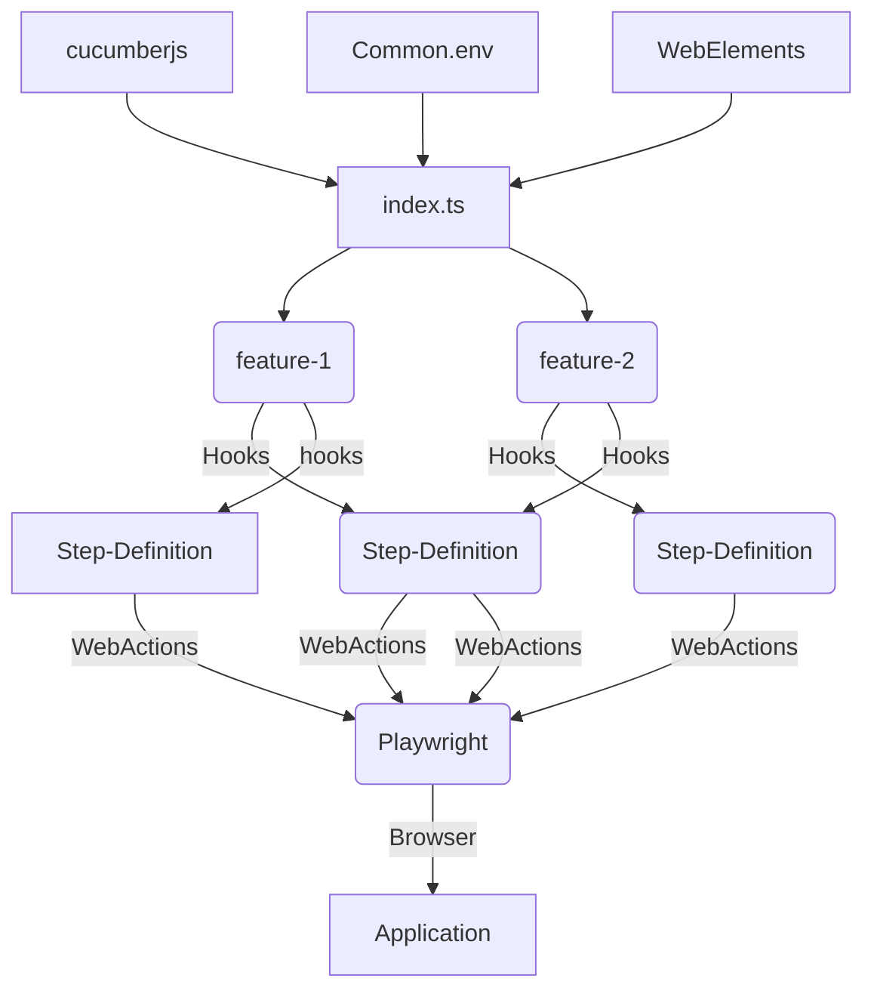

# westpac-calculator-ui-automation
### This is to demonstrate automation of kiwisaver calculator webui using cucumber framework and playwright

### Application Under Test
```
We are using https://www.westpac.co.nz/kiwisaver-investments/kiwisaver/kiwisaver-calculators/kiwisaver-calculator/ as the Application Under Test.

URL: https://www.westpac.co.nz/kiwisaver-investments/kiwisaver/kiwisaver-calculators/kiwisaver-calculator/
OS : macOS
IDE : IntelliJ IDEA
```
### Scenarios
```
Scenario 1: Navigate to the kiwisaver calculator and answer the question to project estimation
Scenario Description: This feature is to test the kiwi saver growth calculator by answering all the questions This is like a Smoke test.

Feature File: 01-kiwisaver-growth-calculator.feature 
```

### Installation
Install the dependencies and devDependencies to run the test.

Clone (OR) Download this repo as zip folder on to your local machine
Navigate to project's directory on terminal and run the following commands:
Clone the repository
```
https://github.com/vipinviswam/westpac-calculator-ui-automation.git

```
## prerequisites
    * NodeJS
    * NPM - version 7 or higher
    * Yarn
    * Docker
### Install dependencies
```
yarn install

```

## Running Test - Local - e2e
    In terminal
        chmod +x run_test.sh
        ./run_test.sh tag
        supported tags - dev, smoke, regression
    
    running in Docker
        qa - docker-compose up --build
        sit - docker-compose-sit up --build

## Reports
    e2e/reports
## FlowChart

